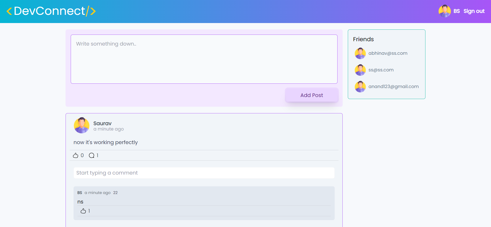

      <h1> socialMedia-react</h1>
     

# Description
The front-end site of our socialMedia app -- a meeting place of Develepors 

# Features
- Scroll away to read the posts of fellow developers -- You'll stop at infinite
- Login/Register to create your post
- Comment on posts after signed in
- Like a fellow developer
- Follow and make friends on the devconnect.
- Happy social networking!!

# Installation
download the code and run  <code>npm install</code> and then <code>npm start</code> to view it in the browser

# Features
This is the complete front-end side of the social-media app we've created using NodeJS. This is built using React.

# Screenshots
 
 
# Tech Used
     
      
